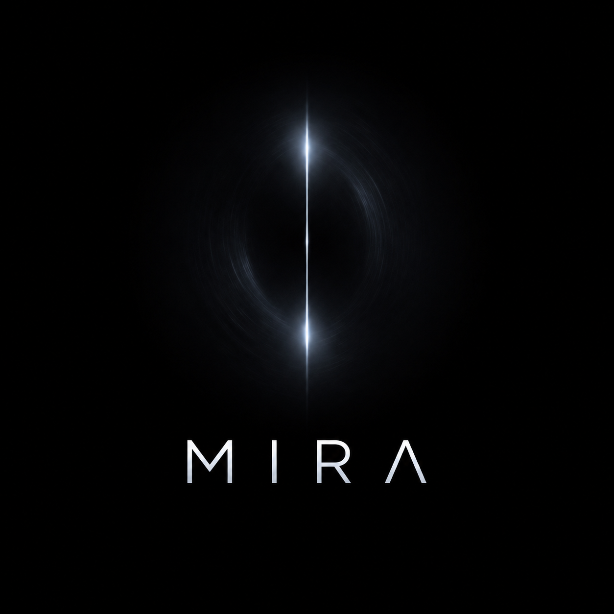

<p align="center">
  
</p>

<h1 align="center">Mira</h1>

<p align="center">
  A system that reflects you.<br/>
  Memory. Context. Intelligence — unified.
</p>

---

## ⬛ Overview

Mira is an AI-driven system designed to ingest, connect, and act on data in real time.

It is built around a simple idea:

> Your system should not just store information — it should understand and respond to it.

Mira combines:
- Data ingestion pipelines
- Context-aware processing
- Event-driven automation
- Persistent memory systems

---

## ⬛ Core Capabilities

- **Ingestion Engine**  
  Capture data from multiple sources (APIs, streams, files)

- **Context Linking**  
  Build relationships between events, entities, and history

- **Memory Layer**  
  Store and retrieve both structured and unstructured data

- **Automation Engine**  
  Trigger actions based on events and context

- **Extensible Architecture**  
  Modular components for rapid expansion

---

## ⬛ Architecture

```text
[ Sources ] → [ Ingestion ] → [ Processing ] → [ Memory ]
                                         ↓
                                   [ Automation ]
