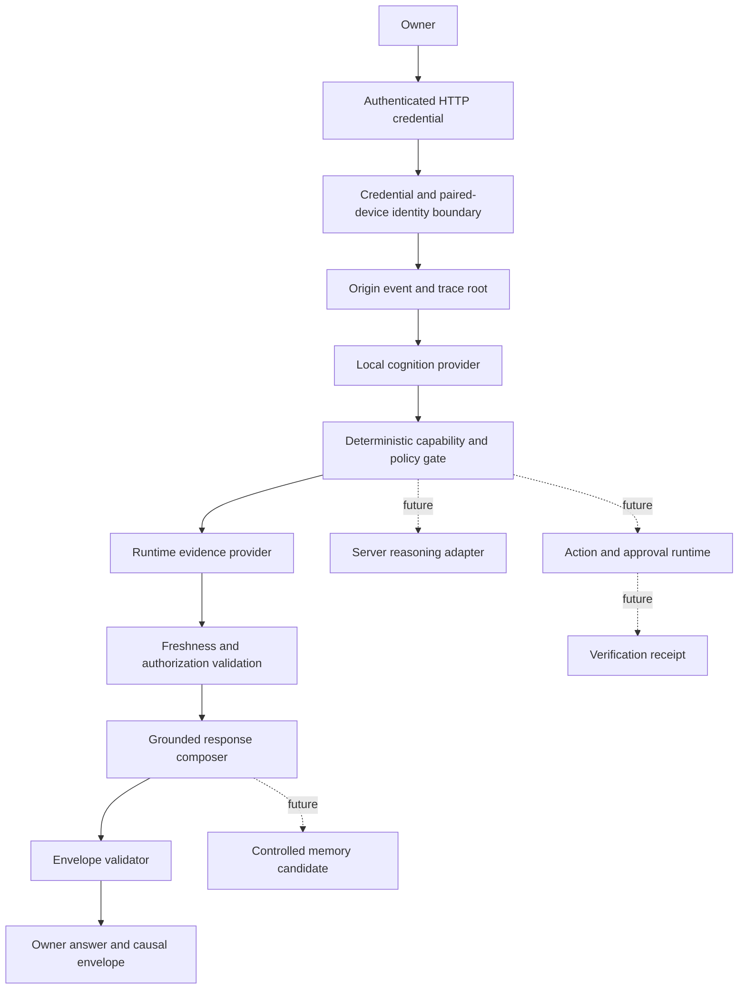

# Mira Greenfield Vertical Slice

## Delivery status

This document records the implementation boundary for Mira's first authenticated, traced, evidence-grounded vertical slice. The implemented journey is deliberately narrow: an authenticated HTTP owner request from one configured paired device asks for current Mira runtime status, receives fresh source evidence, and returns a validated causal envelope. Actions and durable memory remain disabled.

| Requirement | Status | Evidence |
| --- | --- | --- |
| Architecture and service boundaries | DOCUMENTED | This document |
| Provider-independent contracts | IMPLEMENTED | `server/src/core/greenfield/contracts.ts` |
| Deterministic policy and semantic validation | IMPLEMENTED | `policy.ts` and `validation.ts` |
| Authenticated greenfield HTTP request path | IMPLEMENTED | `server/src/core/http-server/api/greenfield/` |
| Server-controlled owner and paired-device identity | IMPLEMENTED | `EnvironmentIdentityResolver` and `CredentialVerifyingIdentityResolver` |
| Typed local capability routing | IMPLEMENTED | `CapabilityLocalCognitionProvider` |
| Fresh runtime-status evidence | IMPLEMENTED | `SystemStatusEvidenceProvider` and `MiraRuntimeStatusReader` |
| Grounded response with explicit limitations | IMPLEMENTED | `SystemStatusResponseComposer` |
| Complete in-memory causal envelope | IMPLEMENTED | `GreenfieldRequestOrchestrator` |
| Contract, policy, runtime, credential, and HTTP tests | IMPLEMENTED | `test/greenfield/*.spec.ts` |
| Pull-request validation workflow | IMPLEMENTED | `.github/workflows/greenfield-ci.yml` |
| Server type-check and greenfield tests | TESTED | GitHub Actions run `29113478438`: type-check succeeded; 6 files and 26 tests passed |
| Durable trace persistence | NOT YET STARTED | Envelope is returned but not stored |
| MiniCPM5 natural-language provider | NOT YET STARTED | Provider interface exists; deterministic router is active |
| Server-model escalation | NOT YET STARTED | Contract fields exist; no adapter is mounted |
| Verified action connector | NOT YET STARTED | Runtime always emits `action: null` |
| Durable memory and purge migrations | NOT YET STARTED | Runtime always emits `memory_candidate: null` |
| Production deployment verification | BLOCKED | No deployment acceptance run has been observed |

## Repository state

- Repository: `selmer512/mira`
- Base branch: `develop`
- Base commit: `059d5b5fea878620160c61320c4cc4a8f7253426`
- Development branch: `greenfield/vertical-slice-foundation-20260710`
- Validated implementation commit: `3701a080b796f6a62f9fb828a979f9833be96cf5`
- Target: Node.js 24+, npm 11.3+, TypeScript, Fastify, React/Vite, and the existing Python bridge

## Implemented owner journey

```text
Authenticated HTTP credential
  -> server-controlled owner/device resolution
  -> origin event and trace root
  -> deterministic typed capability route
  -> current runtime-status evidence
  -> freshness, permission, privacy, and trace validation
  -> grounded response or explicit limitation
  -> validated causal envelope returned to the owner
```

The current endpoint supports exactly one read-only capability:

```text
system.status.read
```

The request cannot define its own owner, trust level, permissions, privacy zones, route, evidence, action, or memory. Fastify removes undeclared request fields, and all authoritative values are resolved or created by server-side deterministic components.

## Requirement matrix

| Requirement | Implemented boundary | Remaining work | Security acceptance |
| --- | --- | --- | --- |
| Owner and device identity | API credential is checked at transport and identity boundaries; one server-configured owner/device pair is resolved | Persistent pairing, revocation, rotation, and short-lived sessions | Client-supplied trust fields cannot alter resolved identity |
| One causal trace | Four linked spans cover identity, routing, evidence, and response | Append-only trace persistence, retention, redaction, UI query | Every span reaches one origin root and remains owner/device bound |
| Typed local routing | Replaceable provider interface with deterministic capability router | Schema-constrained MiniCPM5 adapter and fallback tests | Provider output never grants permissions or bypasses policy |
| Fresh current evidence | Evidence has observation time, validity window, owner, device, permission, privacy class, revision, and hash | Connector registry and cache policy | Current answers use fresh authorized evidence or explicit limitation |
| Grounded response | Response references only evidence in the current envelope | Optional model-assisted phrasing with evidence lock | No current fact is invented when evidence is unavailable |
| Server escalation | Contract fields are present but inactive | Provider adapters and privacy-aware escalation policy | Escalation remains trace-linked and deterministic |
| Actions and receipts | Contracts and deny-by-default checks exist; no executor is mounted | Capability registry, approval UI, executor, independent verifier | No action can execute in this slice |
| Controlled memory | Candidate policy exists; orchestration emits no candidate | Canonical store, confirmation, projections, purge | No durable memory is written in this slice |
| Runtime UI state | Real operational events are generated from route/evidence/response spans | Socket bridge and Aurora rendering | UI state must reference a real span and requesting device |

## Logical architecture



This remains a modular monolith. Interfaces are extraction boundaries, not a requirement for premature microservices.

## Dependency and authority rules

1. Fastify transport depends on greenfield orchestration.
2. Orchestration depends on stable contracts and deterministic policy.
3. Identity, cognition, evidence, response, action, verification, and memory adapters implement contracts but cannot redefine them.
4. Models may propose typed routing, response phrasing, arguments, or memory candidates.
5. Identity, permission, privacy, freshness, risk, approval, execution, verification, retention, purge, and deployment decisions remain deterministic.
6. The default runtime reads existing Mira status without routing through legacy NLU or mutating conversation state.

## Security controls

- The route is disabled unless `MIRA_GREENFIELD_ENABLED=true`.
- The API key is compared in constant time; failed middleware authentication terminates the request.
- The identity boundary independently verifies the same configured credential.
- Owner ID, paired device, permissions, and privacy zones come from server configuration.
- Undeclared body fields are removed before orchestration and cannot override trust.
- The raw credential is never placed in the envelope; only a truncated SHA-256 session fingerprint is retained.
- Only the read-only `system.status.read` capability is mounted.
- Current evidence expires after 30 seconds and includes revision and content hash.
- Evidence failure produces an explicit inability-to-confirm response.
- Actions, approvals, receipts, and memory candidates are `null`.
- The complete envelope is structurally and semantically validated before return.

## Configuration

```dotenv
MIRA_OVER_HTTP=true
MIRA_HTTP_API_KEY=<generated-secret>
MIRA_GREENFIELD_ENABLED=true
MIRA_GREENFIELD_OWNER_ID=<stable-owner-id>
MIRA_GREENFIELD_PAIRED_DEVICE_ID=<stable-device-id>
MIRA_GREENFIELD_PERMISSIONS=system.status.read
MIRA_GREENFIELD_PRIVACY_ZONES=private
```

The environment resolver is a first-slice adapter, not the final identity platform.

## HTTP contract

```http
POST /api/v1/greenfield/request
X-API-Key: <configured key>
Content-Type: application/json
```

```json
{
  "device_id": "<configured paired device>",
  "capability": "system.status.read",
  "input": "Report the current Mira system status."
}
```

A successful response includes the grounded `answer`, the validated `envelope`, and source `evidence_payloads` keyed by evidence ID.

## Validation evidence

The repository has no root lockfile, so CI uses an explicit side-effect-free install and builds Aurora declarations before server type-checking.

Observed in GitHub Actions run `29113478438`:

```bash
npm install --ignore-scripts --legacy-peer-deps --no-audit --no-fund
npm run build --workspace aurora
npx tsc --noEmit --project tsconfig.json
npm run test:greenfield
```

Results:

- Node.js 24 setup: TESTED
- Dependency installation: TESTED
- Aurora type declaration build: TESTED
- Full server TypeScript type-check: TESTED
- Greenfield Vitest suites: TESTED — 6 files passed, 26 tests passed

Still required on a connected runner:

```bash
npm run lint
npm run build:server
npm run test:agentic-loop:unit
npm run test:over-http
```

## Deployment plan

1. Review the branch diff and unresolved review threads.
2. Run the remaining validation commands using Node.js 24+ and npm 11.3+.
3. Start Mira with `MIRA_GREENFIELD_ENABLED=false` and verify legacy startup.
4. Configure a non-production owner, paired device, credential, permission, and privacy zone.
5. Enable the route and call it from the paired test device.
6. Verify evidence validity, owner/device binding, four-span continuity, operational states, and null action/memory fields.
7. Exercise disabled, missing-key, incorrect-key, unpaired-device, undeclared-field, evidence-failure, and degraded-provider paths.
8. Keep the pull request in draft until deployment and remaining regression evidence are attached.

## Rollback

1. Set `MIRA_GREENFIELD_ENABLED=false` for immediate rollback.
2. Revert the branch commits to remove the route, runtime, tests, CI, API-key hardening, and environment documentation.
3. Restart and verify legacy HTTP and socket paths.

No data rollback is required because this increment adds no migration or persistence.

## Known limitations

- Deployment, startup, lint, full production build, legacy HTTP, and agentic-loop outputs have not been observed for this branch.
- Identity is limited to one configured owner/device and one long-lived HTTP credential.
- The local cognition implementation is deterministic and does not invoke MiniCPM5-1B.
- Trace and evidence payloads are returned but not durably stored or encrypted by this slice.
- No client UI consumes operational-state events.
- Server reasoning, actions, verification execution, memory persistence, and purge are not mounted.
- Runtime evidence covers Mira process/provider status only.

## Next milestone

Implement durable append-only trace persistence with retention and redaction. Then add a schema-constrained MiniCPM5 adapter behind the existing provider interface and render trace-backed operational states in the client, preserving the deterministic capability router as fallback. Server escalation, actions, and memory remain disabled until their policy, verification, persistence, purge, and end-to-end acceptance evidence exist.
