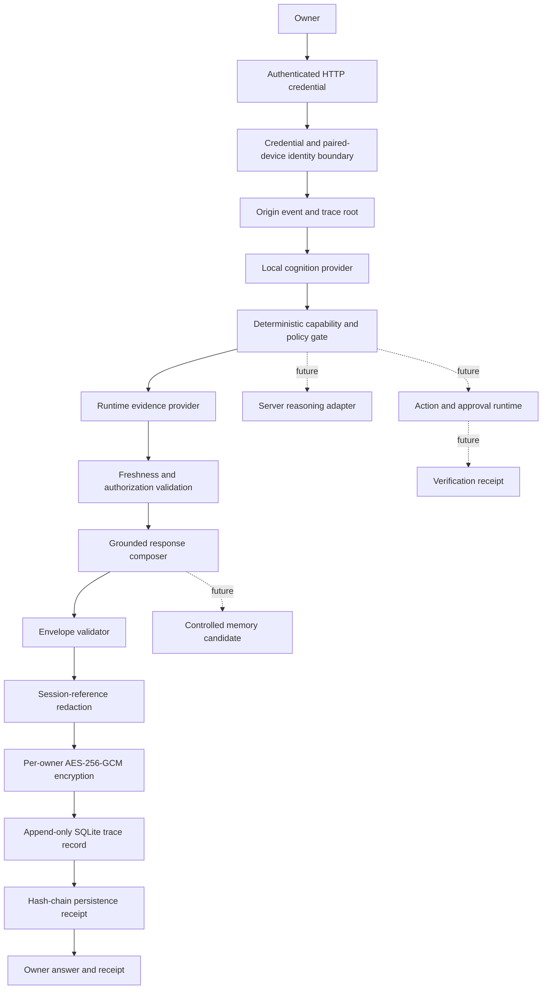

# Mira Greenfield Vertical Slice

## Delivery status

This document records the implementation boundary for Mira's first authenticated, traced, evidence-grounded vertical slice. The current owner journey is deliberately narrow: an authenticated HTTP request from one configured paired device asks for current Mira runtime status, receives fresh evidence, produces a validated causal envelope, encrypts and appends that envelope to a dedicated trace database, and returns only after durable persistence succeeds. Actions and durable memory remain disabled.

| Requirement | Status | Evidence |
| --- | --- | --- |
| Architecture and service boundaries | DOCUMENTED | This document |
| Provider-independent contracts | IMPLEMENTED | `server/src/core/greenfield/contracts.ts` |
| Deterministic policy and semantic validation | IMPLEMENTED | `policy.ts` and `validation.ts` |
| Authenticated greenfield HTTP request path | IMPLEMENTED | `server/src/core/http-server/api/greenfield/` |
| Server-controlled owner and paired-device identity | IMPLEMENTED | `EnvironmentIdentityResolver` and `CredentialVerifyingIdentityResolver` |
| Typed local capability routing | IMPLEMENTED | `CapabilityLocalCognitionProvider` |
| Fresh runtime-status evidence | IMPLEMENTED | `SystemStatusEvidenceProvider` and `MiraRuntimeStatusReader` |
| Grounded response with explicit limitations | IMPLEMENTED | `SystemStatusResponseComposer` |
| Complete causal envelope | IMPLEMENTED | `GreenfieldRequestOrchestrator` |
| Versioned trace schema migration | IMPLEMENTED | `trace-migrations.ts`, migration version 1 |
| Encrypted append-only trace persistence | IMPLEMENTED | `EncryptedSqliteTraceStore` |
| Per-owner hash chain and integrity verification | IMPLEMENTED | `append()` and `verifyOwnerChain()` |
| Session redaction before persistence | IMPLEMENTED | deterministic session-reference redaction |
| Retention deadline and physical purge engine | IMPLEMENTED | `purgeExpired()` and `purgeOwnerTraces()` |
| Content-free purge receipts | IMPLEMENTED | `greenfield_trace_purge_receipts` |
| Fail-closed persistence boundary | IMPLEMENTED | `PersistingGreenfieldRequestOrchestrator` |
| Owner-facing persistence receipt | IMPLEMENTED | `trace_persistence` response field |
| Pull-request validation workflow | IMPLEMENTED | `.github/workflows/greenfield-ci.yml` |
| Server type-check and greenfield tests | TESTED | GitHub Actions run `29114496308`: 7 files and 38 tests passed |
| Automatic retention scheduler | NOT YET STARTED | purge engine exists but no maintenance scheduler is mounted |
| Key rotation and re-encryption | NOT YET STARTED | one configured master-key generation is supported |
| Event-type-specific retention policies | NOT YET STARTED | the current owner-request slice uses one configured retention window |
| MiniCPM5 natural-language provider | NOT YET STARTED | provider interface exists; deterministic router is active |
| Server-model escalation | NOT YET STARTED | contract fields exist; no adapter is mounted |
| Verified action connector | NOT YET STARTED | runtime always emits `action: null` |
| Durable memory and memory purge migrations | NOT YET STARTED | runtime always emits `memory_candidate: null` |
| Production deployment verification | BLOCKED | no deployment acceptance run has been observed |

## Repository state

- Repository: `selmer512/mira`
- Base branch: `develop`
- Base commit: `059d5b5fea878620160c61320c4cc4a8f7253426`
- Development branch: `greenfield/vertical-slice-foundation-20260710`
- Validated implementation commit: `1f0c090e2c77fdb940cf074c0497488fd1cddf78`
- Draft pull request: `#13`
- Target: Node.js 24+, npm 11.3+, TypeScript, Fastify, React/Vite, and the existing Python bridge

## Implemented owner journey

```text
Authenticated HTTP credential
  -> server-controlled owner/device resolution
  -> origin event and trace root
  -> deterministic typed capability route
  -> current runtime-status evidence
  -> freshness, permission, privacy, and trace validation
  -> grounded response or explicit limitation
  -> session-reference redaction
  -> AES-256-GCM per-owner encryption
  -> append-only hash-chained SQLite record
  -> validated persistence receipt
  -> owner response
```

The current endpoint supports exactly one read-only capability:

```text
system.status.read
```

The request cannot define its own owner, trust level, permissions, privacy zones, route, evidence, action, memory, retention, encryption, or purge policy. Fastify removes undeclared request fields, and all authoritative values are resolved or created by deterministic server components.

## Requirement matrix

| Requirement | Implemented boundary | Remaining work | Security acceptance |
| --- | --- | --- | --- |
| Owner and device identity | API credential is checked at transport and identity boundaries; one server-configured owner/device pair is resolved | Persistent pairing, revocation, rotation, and short-lived sessions | Client-supplied trust fields cannot alter resolved identity |
| Complete causal trace | Four linked spans cover identity, routing, evidence, and response | More component spans as server reasoning, actions, memory, and UI are mounted | Every span reaches one origin root and remains owner/device bound |
| Durable trace storage | Dedicated Node.js SQLite database with migration ledger, WAL, full synchronous writes, secure delete, encrypted envelope, and append-only update guard | Backup, replica, disaster-recovery, and deployment evidence | Request fails unless the validated envelope is durably appended |
| Trace confidentiality | AES-256-GCM with an HKDF-derived per-owner key; owner and device metadata are HMAC identifiers; session references are redacted | HSM/OS-keystore integration and rotation | Raw owner, device, credential, session, request, and envelope plaintext do not appear at rest |
| Trace integrity | Record hash covers authenticated metadata, IV, tag, and ciphertext; each owner record links to its predecessor | Signed checkpoints and cross-device replication verification | Chain verification detects missing, altered, or unreceipted deletion |
| Trace retention and purge | Every record has a retention deadline; selective and expired records are physically deleted with secure-delete, WAL truncation, vacuum, and content-free receipts | Scheduler, UI, authorization workflow, event-type policy matrix | Purged content is absent while receipt hashes preserve accountable history |
| Typed local routing | Replaceable provider interface with deterministic capability router | Schema-constrained MiniCPM5 adapter and fallback tests | Provider output never grants permissions or bypasses policy |
| Fresh current evidence | Evidence has observation time, validity window, owner, device, permission, privacy class, revision, and hash | Connector registry and cache policy | Current answers use fresh authorized evidence or explicit limitation |
| Grounded response | Response references only evidence in the current envelope | Optional model-assisted phrasing with evidence lock | No current fact is invented when evidence is unavailable |
| Server escalation | Contract fields are present but inactive | Provider adapters and privacy-aware escalation policy | Escalation remains trace-linked and deterministic |
| Actions and receipts | Contracts and deny-by-default checks exist; no executor is mounted | Capability registry, approval UI, executor, independent verifier | No action can execute in this slice |
| Controlled memory | Candidate policy exists; orchestration emits no candidate | Canonical store, confirmation, projections, and cross-store purge | No durable memory is written in this slice |
| Runtime UI state | Real operational events are generated from route/evidence/response spans | Socket bridge and Aurora rendering | UI state must reference a real span and requesting device |

## Logical architecture



This remains a modular monolith. Interfaces are extraction boundaries, not a requirement for premature microservices.

## Trace storage design

The trace database is separate from Mira's existing memory database. The default path is:

```text
core/data/greenfield/traces.sqlite
```

Migration version 1 creates:

- `greenfield_trace_records`
- `greenfield_trace_purge_receipts`
- `greenfield_trace_schema_migrations`
- owner/time, retention, and origin indexes
- an update-blocking trigger for trace records
- update- and delete-blocking triggers for purge receipts

Trace-record DELETE remains available only because deterministic purge must physically remove selected content. The application does not expose arbitrary SQL or a public trace-mutation route.

### Data outside ciphertext

The store keeps only security and lifecycle metadata outside the encrypted envelope:

- trace and origin IDs
- keyed owner and device identifiers
- event type and timestamps
- privacy classification
- previous and current record hashes
- retention deadline
- redaction status
- encryption-key identifier
- encrypted bytes, IV, and authentication tag

### Data inside ciphertext

The validated causal envelope is serialized after session-reference redaction and encrypted with AES-256-GCM. A per-owner encryption key is derived from the configured 32-byte master key using HKDF-SHA256. Authenticated metadata is bound as AEAD additional authenticated data.

### Integrity and purge continuity

Each record hash covers the authenticated metadata, initialization vector, authentication tag, and ciphertext. Each owner record references the preceding record hash. Selective physical purge records the removed record hashes in an immutable receipt, allowing chain verification to distinguish an authorized purge from an unexplained gap.

## Dependency and authority rules

1. Fastify transport depends on greenfield orchestration.
2. Orchestration depends on stable contracts and deterministic policy.
3. The production orchestrator depends on successful trace persistence before returning.
4. Identity, cognition, evidence, response, storage, action, verification, and memory adapters implement contracts but cannot redefine them.
5. Models may propose typed routing, response phrasing, arguments, or memory candidates.
6. Identity, permission, privacy, freshness, risk, approval, execution, verification, retention, purge, encryption, and deployment decisions remain deterministic.
7. The default runtime reads existing Mira status without routing through legacy NLU or mutating conversation state.

## Security controls

- The route is disabled unless `MIRA_GREENFIELD_ENABLED=true`.
- Durable response completion also requires `MIRA_GREENFIELD_TRACE_PERSISTENCE=true`.
- The API key is compared in constant time; failed middleware authentication terminates the request.
- The identity boundary independently verifies the same configured credential.
- Owner ID, paired device, permissions, and privacy zones come from server configuration.
- Undeclared body fields are removed before orchestration and cannot override trust.
- The raw credential is never placed in the envelope; the in-memory session fingerprint is redacted again before persistence.
- Only the read-only `system.status.read` capability is mounted.
- Current evidence expires after 30 seconds and includes revision and content hash.
- Evidence failure produces an explicit inability-to-confirm response.
- Actions, approvals, receipts, and memory candidates are `null`.
- The complete envelope is structurally and semantically validated before encryption.
- The encrypted record is hash-chained and append-only except for deterministic purge.
- Purge receipts contain hashes and counts, not trace plaintext or trace IDs.
- Database directory and file permissions are restricted where the platform supports POSIX modes.

## Configuration

```dotenv
MIRA_OVER_HTTP=true
MIRA_HTTP_API_KEY=<generated-secret>
MIRA_GREENFIELD_ENABLED=true
MIRA_GREENFIELD_OWNER_ID=<stable-owner-id>
MIRA_GREENFIELD_PAIRED_DEVICE_ID=<stable-device-id>
MIRA_GREENFIELD_PERMISSIONS=system.status.read
MIRA_GREENFIELD_PRIVACY_ZONES=private

MIRA_GREENFIELD_TRACE_PERSISTENCE=true
MIRA_GREENFIELD_TRACE_DB_PATH=<optional-absolute-or-repository-relative-path>
MIRA_GREENFIELD_TRACE_MASTER_KEY=<base64-encoded-32-byte-key>
MIRA_GREENFIELD_TRACE_RETENTION_DAYS=30
```

Generate a development key with:

```bash
openssl rand -base64 32
```

The environment-backed identity and key adapters are first-slice implementations, not the final pairing, session, or key-management platform. Do not commit the key or place it in application logs.

## HTTP contract

```http
POST /api/v1/greenfield/request
X-API-Key: <configured key>
Content-Type: application/json
```

```json
{
  "device_id": "<configured paired device>",
  "capability": "system.status.read",
  "input": "Report the current Mira system status."
}
```

A successful response includes:

- `answer`
- validated `envelope`
- source `evidence_payloads`
- `trace_persistence` with trace ID, record hash, predecessor hash, retention deadline, encryption-key identifier, and redaction status

The response is not sent if trace persistence fails.

## Validation evidence

The repository has no root lockfile, so CI uses an explicit side-effect-free install and builds Aurora declarations before server type-checking.

Observed in GitHub Actions run `29114496308` for commit `1f0c090e2c77fdb940cf074c0497488fd1cddf78`:

```bash
npm install --ignore-scripts --legacy-peer-deps --no-audit --no-fund
npm run build --workspace aurora
npx tsc --noEmit --project tsconfig.json
npm run test:greenfield
```

Results:

- Node.js 24 setup: TESTED
- Dependency installation: TESTED
- Aurora type declaration build: TESTED
- Full server TypeScript type-check: TESTED
- Greenfield Vitest suites: TESTED — 7 files passed, 38 tests passed
- Trace migration idempotence: TESTED
- Encrypt, append, decrypt, and redaction: TESTED
- Raw-at-rest plaintext absence: TESTED
- Per-owner hash-chain verification: TESTED
- Duplicate persistence rejection: TESTED
- Owner-isolated lookup: TESTED
- Append-only SQL update guard: TESTED
- Selective physical purge and immutable receipt: TESTED
- Retention purge: TESTED
- Fail-closed orchestration: TESTED

Still required on a connected runner:

```bash
npm run lint
npm run build:server
npm run test:agentic-loop:unit
npm run test:over-http
```

## Deployment plan

1. Review the branch diff and unresolved review threads.
2. Run the remaining validation commands using Node.js 24+ and npm 11.3+.
3. Start Mira with both greenfield feature flags disabled and verify legacy startup.
4. Generate a non-production trace master key in a secret manager or protected environment file.
5. Back up the intended trace directory before first enablement.
6. Enable trace persistence first and verify migration version 1 is applied to the dedicated database.
7. Configure a non-production owner, paired device, credential, permission, privacy zone, and retention window.
8. Enable the greenfield route and call it from the paired test device.
9. Verify evidence validity, owner/device binding, four-span continuity, encrypted storage, persistence receipt, and null action/memory fields.
10. Verify raw owner, device, request, session, and envelope plaintext are absent from the database and WAL files.
11. Exercise disabled, missing-key, malformed-key, incorrect-key, unpaired-device, undeclared-field, duplicate-trace, evidence-failure, storage-failure, retention-purge, and selective-purge paths.
12. Keep the pull request in draft until deployment and remaining regression evidence are attached.

## Rollback

1. Set `MIRA_GREENFIELD_ENABLED=false` for immediate request-path rollback.
2. Set `MIRA_GREENFIELD_TRACE_PERSISTENCE=false` only while the request path remains disabled; the production orchestrator intentionally fails closed without persistence.
3. Preserve the trace database and master key according to the owner-approved retention policy. Do not delete trace data merely to roll back code.
4. Revert the branch commits to remove route, runtime, schema code, tests, CI, API-key hardening, and environment documentation.
5. Restart and verify legacy HTTP and socket paths.
6. When the owner explicitly requests trace deletion, execute deterministic selective purge before removing the database, then retain only content-free purge receipts as policy permits.

The trace migration is isolated in a dedicated database, so it does not alter the existing memory schema. Database deletion is a destructive privacy action and requires owner authorization rather than being an automatic code rollback step.

## Known limitations and risks

- Deployment, startup, lint, full production build, legacy HTTP, and agentic-loop outputs have not been observed for the persistence-enabled branch.
- Identity is limited to one configured owner/device and one long-lived HTTP credential.
- The master key is environment-backed; rotation, re-encryption, HSM/keystore integration, revocation, and recovery are not implemented.
- The current slice uses one configured retention duration because only `owner_request` traces are generated. Event-type-specific policy is not yet implemented.
- Retention and selective purge methods are implemented and tested, but no automatic maintenance scheduler or owner-facing purge UI/API is mounted.
- Backup, restore, replica synchronization, corruption recovery, and multi-device trace convergence are not implemented.
- Trace export is currently owner-scoped programmatic read, not a packaged export workflow.
- The local cognition implementation is deterministic and does not invoke MiniCPM5-1B.
- No client UI consumes operational-state events or trace persistence receipts.
- Server reasoning, actions, verification execution, and memory persistence are not mounted.
- Runtime evidence covers Mira process/provider status only.

## Next milestone

Add a deterministic trace maintenance service for scheduled retention purge, owner-authorized selective export and purge, key-rotation preparation, and integrity health reporting. Then implement a schema-constrained MiniCPM5 adapter behind the existing local-cognition interface and render trace-backed operational states and persistence receipts in the client. Server escalation, actions, and memory remain disabled until their policy, verification, persistence, purge, and end-to-end acceptance evidence exist.
