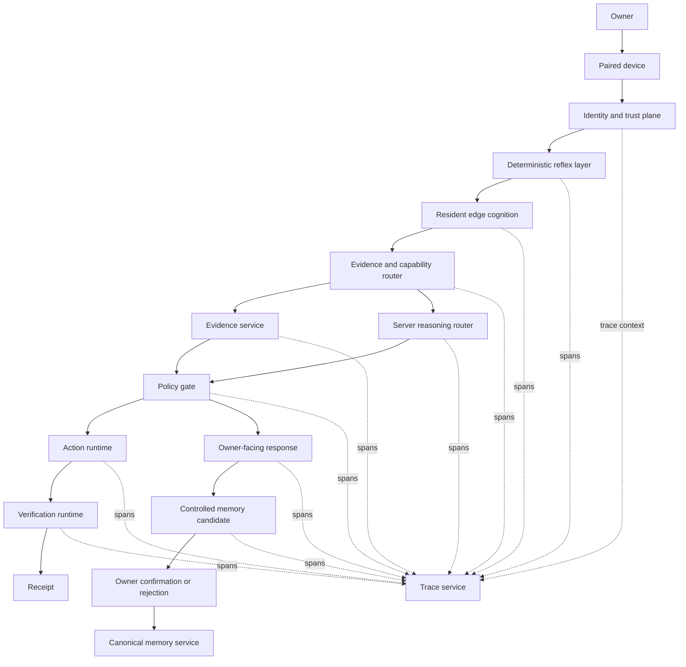

# Mira Greenfield Foundation

## Delivery status

This document establishes the clean-room implementation boundary for Mira's first authenticated, traced, evidence-grounded, optionally actionable, verified, memory-aware vertical slice.

| Requirement | Status | Evidence |
| --- | --- | --- |
| Architecture and service boundaries | DOCUMENTED | This document |
| Provider-independent contracts | IMPLEMENTED | `server/src/core/greenfield/contracts.ts` |
| Deterministic policy checks | IMPLEMENTED | `server/src/core/greenfield/policy.ts` |
| Runtime schema and semantic validation | IMPLEMENTED | `server/src/core/greenfield/validation.ts` |
| Contract acceptance tests | IMPLEMENTED | `test/greenfield/vertical-slice-contracts.spec.ts` |
| Legacy request-path integration | NOT YET STARTED | No route or agent-loop mounting in this change |
| Durable database migrations | NOT YET STARTED | Contract-first foundation only |
| MiniCPM5 provider integration | NOT YET STARTED | Provider contract defined; runtime adapter pending |
| Verified action connector | NOT YET STARTED | Action and receipt contracts defined |
| Production deployment verification | BLOCKED | Requires CI or a connected runtime |

## Current repository state

- Repository: `selmer512/mira`
- Base branch: `develop`
- Base commit: `059d5b5fea878620160c61320c4cc4a8f7253426`
- Target runtime: Node.js 24+, npm 11.3+, TypeScript server, React/Vite client, Python bridge
- Existing validation surface: TypeScript build, lint, JSON schema tests, Jest unit/E2E/HTTP suites, and Vitest agentic-loop suites

## Requirement matrix

| Knowledge requirement | Existing implementation | Gap addressed here | Later affected areas | Tests required | Security concern | Acceptance criterion |
| --- | --- | --- | --- | --- | --- | --- |
| Owner and paired-device identity | Existing application identity is not represented in a vertical-slice trust contract | Add typed identity context with trust level, session, permissions, and privacy zones | Authentication middleware, pairing service, session store | Reject unauthenticated or unpaired requests | Identity spoofing, session replay | Owner and device identity are verified |
| One causal trace | Existing logging is not a complete origin-linked trace contract | Add trace/span schema and continuity validation | Event bus, model calls, tools, UI timeline | Reject orphaned, cross-trace, and cyclic spans | Trace tampering, sensitive log exposure | One trace links origin through final result |
| Typed local routing | Existing model routing is provider-specific and not evidence-aware | Add local routing decision contract | MiniCPM5 adapter, model router | Validate time scope and evidence requirements | Model output must not become policy | Local model produces typed routing output |
| Fresh current-state evidence | Existing tools can return observations without a uniform validity contract | Add evidence observation and freshness checks | Connectors, evidence service, cache | Reject expired or future-invalid evidence | Stale facts, cross-owner leakage | Current requests cannot use unrelated memory |
| Server escalation | Existing agent loop can call providers but lacks origin contract | Add escalation fields tied to the origin trace | Reasoning router, provider adapters | Preserve trace linkage across escalation | Provider data leakage | Escalation links to local origin |
| Deterministic actions | Existing skills can call services without a common risk/approval contract | Add action proposal, approval, verification, and rollback contracts | Tool registry, action gate, connectors | Deny missing permissions and unapproved risky actions | Privilege escalation, confused deputy | Tool arguments are policy validated |
| Verified receipts | Existing action outputs are not proof of success | Add verification receipt contract | Verification service, UI receipts | Reject success without external verification | False success claims | Action status is externally verified |
| Controlled memory | Existing memory behavior lacks the required provenance/temporal candidate contract | Add memory candidate and persistence policy | Relational store, vector index, graph, confirmation UI | Reject owner-rejected or source-free candidates | Sensitive retention, false memory | Rejected candidates are not stored |
| Runtime UI states | Existing UI states are not defined as trace-driven events | Add operational-state event contract | Socket events, Aurora UI | Validate state originates from a real span | Decorative or misleading status | UI states reflect real runtime events |
| Purge | No purge executor is introduced in this foundation | Record required purge boundary and leave implementation explicit | Canonical DB, vector, graph, cache, replicas | Cross-store purge and rebuild tests | Residual deleted content | Canonical and derived content are removed |

## Logical architecture

The first implementation remains a modular monolith. Contracts are extraction boundaries, not a requirement to deploy premature microservices.

## Dependency direction

1. Transport and UI may depend on application orchestration.
2. Application orchestration may depend on greenfield contracts and deterministic policy.
3. Provider adapters may implement contracts but may not redefine them.
4. Generative models may propose routing, arguments, responses, or memory candidates.
5. Identity, permission, privacy, freshness, risk, approval, execution, verification, retention, purge, and deployment decisions remain deterministic.

## First vertical-slice sequence

1. Authenticate the owner session.
2. verify that the requesting device is paired and trusted.
3. Create the origin event and root trace span.
4. Ask the local cognition provider for a typed routing decision.
5. Validate the model output against the routing schema.
6. Enforce evidence requirements from time scope and policy.
7. Retrieve source observations under owner, device, permission, and privacy constraints.
8. Filter current-state evidence by explicit validity window.
9. Escalate to a server model only when the validated route requires it.
10. Produce an owner-facing response with limitations and evidence references.
11. For an action, validate capability, permissions, arguments, risk, approval, and rollback before execution.
12. Verify the external result independently and emit a receipt.
13. Produce a provenance-aware memory candidate.
14. Persist only when deterministic memory policy permits it.
15. Emit operational UI states from actual trace spans.

## Contract ownership

| Contract | Deterministic owner | Model participation |
| --- | --- | --- |
| `IdentityContext` | Identity and device services | None |
| `TraceSpan` | Trace service | May attach structured decision audit only |
| `EvidenceObservation` | Evidence service | May interpret; cannot create source truth |
| `LocalRoutingDecision` | Edge cognition output validated by router | Proposes typed route |
| `ActionProposal` | Action gate | May propose arguments and expected result |
| `VerificationReceipt` | Verification service | None for success determination |
| `MemoryCandidate` | Memory service and owner confirmation | May propose candidate |
| `OperationalStateEvent` | Runtime event bridge | None for event truth |

## Data classification

- `public`: safe for normal display and external processing when policy allows.
- `private`: owner data restricted to trusted Mira services.
- `sensitive`: credentials, precise location, health, biometrics, private communications, and similarly high-impact data; encrypted and minimized.
- `restricted`: secrets or regulated data that may only be handled by explicitly authorized local or dedicated services.

Every evidence, trace data reference, action argument reference, and memory candidate carries a privacy classification or privacy zone. Raw sensitive values should be replaced with encrypted references where possible.

## Threat model

| Threat | Mandatory control in the slice |
| --- | --- |
| Spoofed owner or device | Authenticated session plus paired-device trust check |
| Model-generated permission | Permissions come only from `IdentityContext` |
| Stale evidence presented as current | Explicit validity window and deterministic freshness check |
| Historical memory used as present truth | Current time scope requires fresh evidence; memory is not accepted as current evidence |
| Tool argument injection | Schema validation, capability allowlist, and deterministic permission check |
| Risky action without approval | High and critical risk require approval regardless of model output |
| False action success | Success requires a verification receipt from an external verification method |
| Orphaned downstream activity | Every span must reach the origin root without cycles |
| Cross-owner data leakage | Owner identity must match across envelope, evidence, spans, actions, and memory |
| False or rejected memory retention | Rejected candidates are denied before persistence; purge executor must remove projections |
| Sensitive trace exposure | Store references/hashes, apply privacy classification, encryption, redaction, retention, and purge |
| Provider lock-in | Model and connector details are metadata behind stable contracts |

## Deployment plan

This foundation is additive and has no database migration or route mounting.

1. Install dependencies with the repository's supported Node.js and npm versions.
2. Run `npm run lint`.
3. Run `npm run build:server`.
4. Run `npm run test:greenfield`.
5. Run the existing unit and agentic-loop suites.
6. Merge only after the new contract tests and existing required checks pass.

## Rollback plan

Revert the commits on this branch. The added files are isolated under `docs/greenfield`, `server/src/core/greenfield`, `test/greenfield`, and `vitest.greenfield.config.ts`. The package change adds only one script. No data rollback is required because this foundation introduces no persistence or migration.

## Next milestone

Wire one existing request entry point to create an authenticated vertical-slice envelope, emit real trace spans, obtain a typed local routing decision through a replaceable provider, enforce evidence freshness, and return a source-grounded response. Actions and memory persistence remain disabled until their deterministic gates and backing stores are integrated.