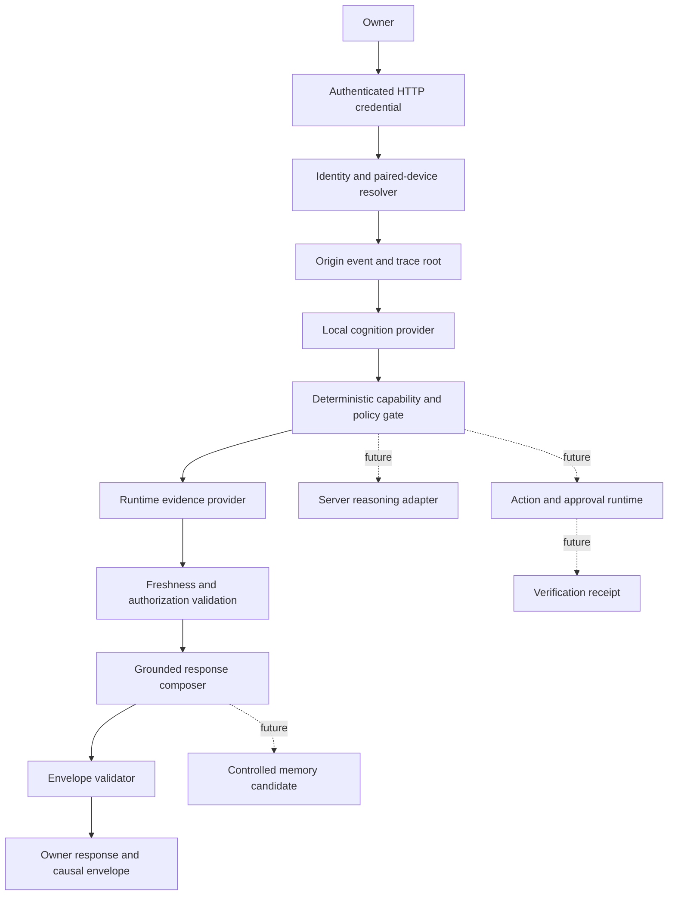

# Mira Greenfield Vertical Slice

## Delivery status

This document records the current implementation boundary for Mira's first authenticated, traced, evidence-grounded vertical slice. The implemented journey is deliberately narrow: an authenticated HTTP owner request from one configured paired device asks for current Mira runtime status, receives fresh source evidence, and returns a validated causal envelope. Actions and durable memory remain disabled.

| Requirement | Status | Evidence |
| --- | --- | --- |
| Architecture and service boundaries | DOCUMENTED | This document |
| Provider-independent contracts | IMPLEMENTED | `server/src/core/greenfield/contracts.ts` |
| Deterministic policy checks | IMPLEMENTED | `server/src/core/greenfield/policy.ts` |
| Runtime schema and semantic validation | IMPLEMENTED | `server/src/core/greenfield/validation.ts` |
| Authenticated greenfield HTTP request path | IMPLEMENTED | `server/src/core/http-server/api/greenfield/` |
| Server-controlled owner and paired-device resolution | IMPLEMENTED | `EnvironmentIdentityResolver` in `server/src/core/greenfield/runtime.ts` |
| Typed local capability routing | IMPLEMENTED | `CapabilityLocalCognitionProvider` |
| Fresh runtime-status evidence | IMPLEMENTED | `SystemStatusEvidenceProvider` and `MiraRuntimeStatusReader` |
| Grounded response with explicit limitations | IMPLEMENTED | `SystemStatusResponseComposer` |
| Complete in-memory causal envelope | IMPLEMENTED | `GreenfieldRequestOrchestrator` |
| Route and runtime test definitions | IMPLEMENTED | `test/greenfield/*.spec.ts` |
| Test execution | BLOCKED | Requires a Node.js 24/npm 11 repository runner |
| Durable trace persistence | NOT YET STARTED | Envelope is returned but not stored |
| MiniCPM5 natural-language provider integration | NOT YET STARTED | Replaceable provider interface exists; deterministic router is active |
| Server-model escalation | NOT YET STARTED | Routing contract exists; no escalation adapter is mounted |
| Verified action connector | NOT YET STARTED | Action and receipt contracts exist; runtime always emits `action: null` |
| Durable memory and purge migrations | NOT YET STARTED | Runtime always emits `memory_candidate: null` |
| Production deployment verification | BLOCKED | No deployment or observed acceptance run |

## Current repository state

- Repository: `selmer512/mira`
- Base branch: `develop`
- Base commit: `059d5b5fea878620160c61320c4cc4a8f7253426`
- Development branch: `greenfield/vertical-slice-foundation-20260710`
- Target runtime: Node.js 24+, npm 11.3+, TypeScript server, Fastify HTTP API, React/Vite client, Python bridge
- Existing validation surface: TypeScript build, lint, JSON schema tests, Jest unit/E2E/HTTP suites, and Vitest suites

## Implemented owner journey

```text
Authenticated HTTP credential
  -> server-controlled owner/device resolution
  -> origin event and root trace span
  -> deterministic typed capability route
  -> current runtime-status evidence read
  -> freshness, permission, privacy, and trace validation
  -> grounded response or explicit evidence limitation
  -> validated causal envelope returned to the owner
```

The current endpoint supports exactly one read-only capability:

```text
system.status.read
```

The request cannot assert its own owner ID, trust level, permissions, privacy zones, route, evidence, action, or memory. Those values are resolved or created by server-side deterministic components.

## Requirement matrix

| Knowledge requirement | Existing implementation | Implemented gap | Later affected areas | Tests required | Security concern | Acceptance criterion |
| --- | --- | --- | --- | --- | --- | --- |
| Owner and paired-device identity | Legacy HTTP API uses one API key | Server-configured owner/device resolver binds a credential fingerprint to one paired device | Pairing service, session store, key rotation | Reject disabled, unconfigured, unauthenticated, and unpaired requests | Identity spoofing, session replay | Owner and device identity are verified without accepting client trust claims |
| One causal trace | Existing logs are not a complete origin-linked trace | Four linked spans cover identity, routing, evidence, and response | Durable trace store, event bus, UI timeline | Reject orphaned, cross-owner, cross-trace, cyclic, and false UI spans | Trace tampering, sensitive log exposure | Every returned span reaches one origin root |
| Typed local routing | Existing routing is provider-specific | Replaceable `LocalCognitionProvider` with deterministic capability implementation | MiniCPM5 adapter, model router | Validate capability, time scope, evidence requirement, and escalation fields | Model output must not become policy | Provider output is schema and policy validated |
| Fresh current-state evidence | Existing tools lack one uniform validity contract | Runtime evidence carries observation time, validity window, revision, hash, owner, device, permission, and privacy classification | Connector registry, evidence cache | Reject stale, future-invalid, unauthorized, or cross-owner evidence | Stale facts, cross-owner leakage | Current answers contain fresh evidence or an explicit limitation |
| Grounded response | Existing response path can synthesize from mixed context | Deterministic response references only evidence in the current envelope | Model-assisted response composer | Reject missing evidence references and unsupported success claims | Hallucinated current facts | Response cites present evidence or states it cannot confirm |
| Server escalation | Existing agent loop can call providers but lacks this envelope contract | Escalation fields are typed but inactive | Reasoning router, provider adapters | Preserve origin trace and privacy constraints | Provider data leakage | Escalation remains deterministic and trace-linked |
| Deterministic actions | Existing skills can call services without a common gate | Contracts and deny-by-default policy exist; no executor is mounted | Capability registry, approval UI, connectors | Deny missing permissions, mismatched approvals, and unsafe risk declarations | Privilege escalation, confused deputy | Execution is impossible until policy admits it |
| Verified receipts | Existing action output is not proof of success | Receipt/action consistency and verification requirements are enforced | Verification service, receipt UI | Reject status mismatch and success without verification evidence | False success claims | Reported success is independently verified |
| Controlled memory | Existing memory behavior lacks the required candidate contract | Candidate and persistence policy exist; orchestration emits no candidate | Relational store, vector index, graph, confirmation UI | Reject owner-rejected, source-free, or privacy-zone-denied candidates | Sensitive retention, false memory | No durable memory is written in this slice |
| Runtime UI states | Existing UI states are not uniformly trace-driven | Operational-state events are generated from real routing/evidence/response spans | Socket bridge, Aurora UI | Validate trace, span, owner device, and source | Decorative or misleading status | UI can render only trace-backed states |
| Purge | No new persistence exists in this slice | No data migration or derived index is introduced | Canonical DB, vector, graph, cache, replicas | Cross-store purge and rebuild tests | Residual deleted content | Persistence cannot be enabled before purge coverage exists |

## Logical architecture



The implementation remains a modular monolith. Interfaces are extraction boundaries, not a requirement to deploy premature microservices.

## Dependency direction

1. Fastify transport depends on greenfield application orchestration.
2. Application orchestration depends on contracts and deterministic policy.
3. Identity, cognition, evidence, response, action, verification, and memory providers implement stable interfaces.
4. Provider adapters may propose typed output but may not redefine contracts or policy.
5. Identity, permission, privacy, freshness, risk, approval, execution, verification, retention, purge, and deployment decisions remain deterministic.
6. The default runtime dynamically reads existing Mira runtime state but does not route through legacy NLU or mutate legacy conversation state.

## Security controls in this increment

- The route is disabled unless `MIRA_GREENFIELD_ENABLED=true`.
- The global HTTP API key is compared in constant time; failed authentication explicitly terminates the request.
- Owner ID, paired device ID, permissions, and privacy zones come from server configuration, not request fields.
- The API schema rejects additional fields, preventing a caller from injecting trust or policy attributes.
- The raw credential is not placed in the envelope; a truncated SHA-256 fingerprint identifies the authenticated session.
- The only mounted capability is a read-only runtime status query.
- Current-state evidence expires after 30 seconds.
- Evidence source payloads are hashed and revisioned.
- If evidence collection fails, the response says the current state cannot be confirmed.
- The orchestrator sets action, approval, receipt, and memory candidate to `null`.
- The completed envelope is validated before it is returned.

## Configuration

The route is mounted only when the existing HTTP API is enabled and the greenfield feature flag is enabled.

```dotenv
MIRA_OVER_HTTP=true
MIRA_HTTP_API_KEY=<generated-secret>
MIRA_GREENFIELD_ENABLED=true
MIRA_GREENFIELD_OWNER_ID=<stable-owner-id>
MIRA_GREENFIELD_PAIRED_DEVICE_ID=<stable-device-id>
MIRA_GREENFIELD_PERMISSIONS=system.status.read
MIRA_GREENFIELD_PRIVACY_ZONES=private
```

This environment-backed resolver is a first vertical-slice adapter, not the final identity platform. A persistent pairing service, short-lived sessions, credential rotation, revocation, and multi-device trust records remain required.

## HTTP contract

```http
POST /api/v1/greenfield/request
X-API-Key: <configured key>
Content-Type: application/json
```

```json
{
  "device_id": "<configured paired device>",
  "capability": "system.status.read",
  "input": "Report the current Mira system status."
}
```

A successful response includes:

- `answer`: the grounded owner-facing result
- `envelope`: identity, origin, route, evidence metadata, trace spans, response metadata, null action/memory fields, and operational states
- `evidence_payloads`: source payloads keyed by evidence ID

## Validation commands

Run on a connected repository runner using the supported toolchain:

```bash
npm ci
npm run lint
npm run build:server
npm run test:greenfield
npm run test:agentic-loop:unit
npm run test:over-http
```

No command in this list is reported as passing until its output is observed.

## Deployment plan

1. Review the branch diff and unresolved review threads.
2. Install dependencies using Node.js 24+ and npm 11.3+.
3. Run all validation commands above.
4. Start Mira with `MIRA_GREENFIELD_ENABLED=false` and confirm legacy startup remains healthy.
5. Configure a non-production owner ID, paired device ID, API key, permissions, and privacy zones.
6. Enable the route and call the system-status endpoint from the paired test device.
7. Verify the returned evidence validity window, owner/device binding, four-span trace continuity, operational states, and null action/memory fields.
8. Exercise disabled, missing-key, incorrect-key, unpaired-device, invalid-body, evidence-failure, and degraded-provider paths.
9. Keep the pull request in draft until test and deployment evidence are attached.

## Rollback plan

1. Set `MIRA_GREENFIELD_ENABLED=false` for immediate feature rollback.
2. Revert the branch commits to remove the route, runtime, tests, API-key hardening, and environment documentation.
3. Restart the server and verify the legacy HTTP and socket paths.

No data rollback is required because this increment adds no migration, durable trace store, action execution, or memory persistence.

## Known risks and limitations

- Test, build, lint, startup, and deployment output have not been observed in the current environment.
- The identity adapter supports one environment-configured owner/device pair and one long-lived HTTP credential; it is not the final pairing/session service.
- `CapabilityLocalCognitionProvider` is deterministic and does not invoke MiniCPM5-1B. This is intentional until a model adapter can be schema-validated and tested without granting policy authority.
- Trace and evidence payloads are returned to the authenticated caller but are not durably stored or encrypted by this slice.
- No real UI consumes operational-state events yet.
- Server reasoning, actions, verification execution, memory persistence, and purge are not mounted.
- Runtime evidence is limited to Mira process and provider status; external source connectors are not yet integrated.

## Next milestone

Implement durable append-only trace persistence with retention and redaction, then add a schema-constrained MiniCPM5 local-cognition adapter behind the existing provider interface. Mount trace-backed operational states in the client and preserve the deterministic capability router as the fallback. Server escalation, actions, and memory remain disabled until their corresponding policy, verification, persistence, purge, and end-to-end acceptance evidence exist.
